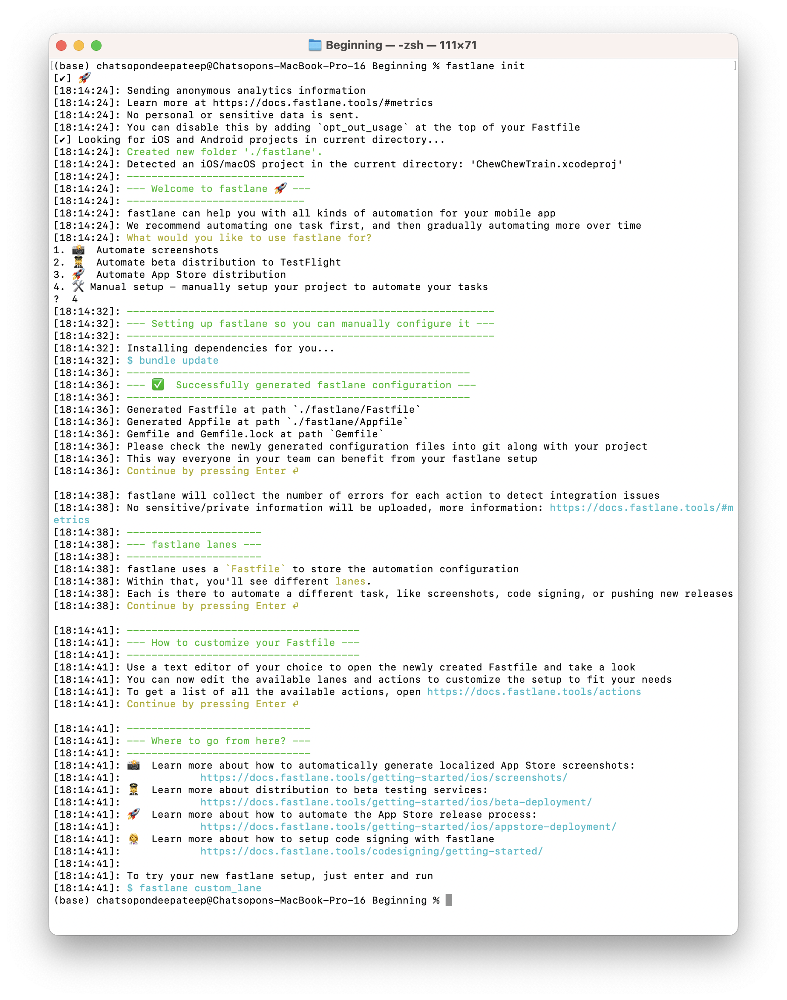
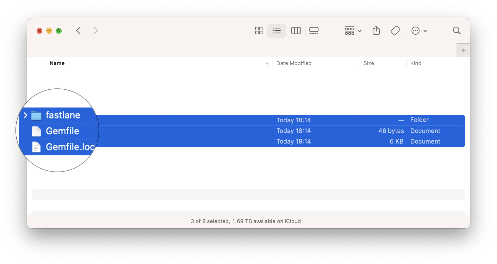
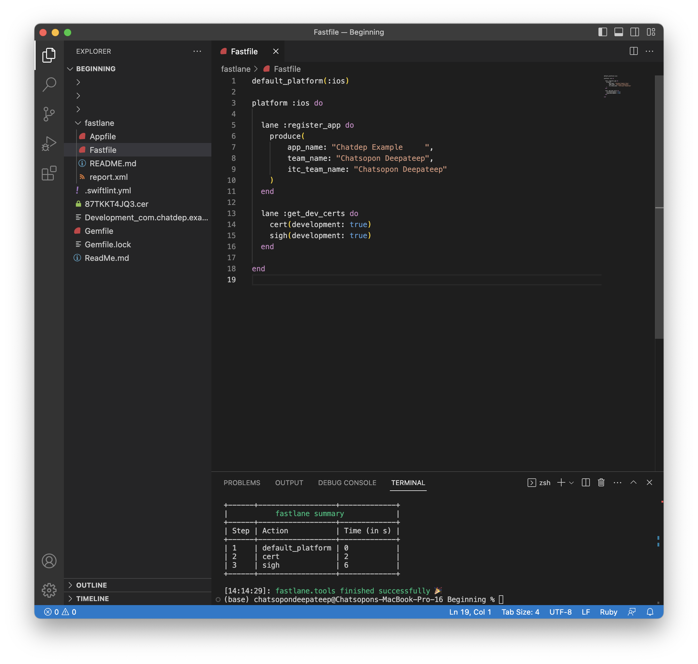
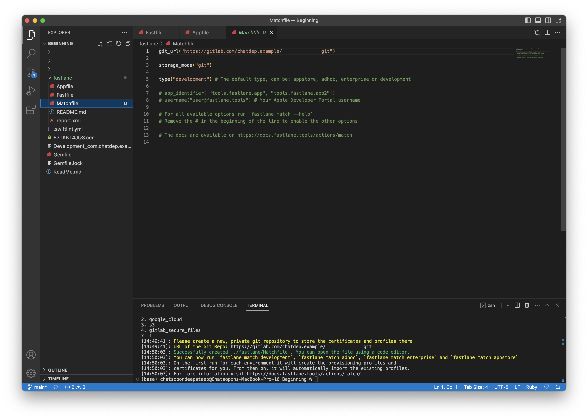
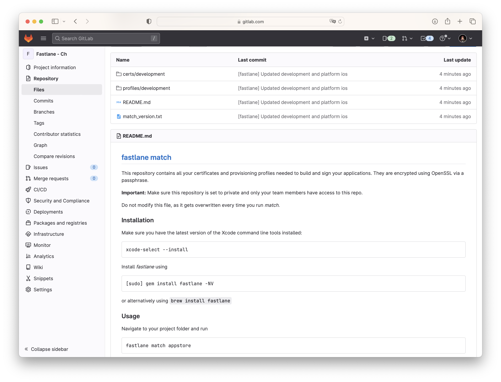
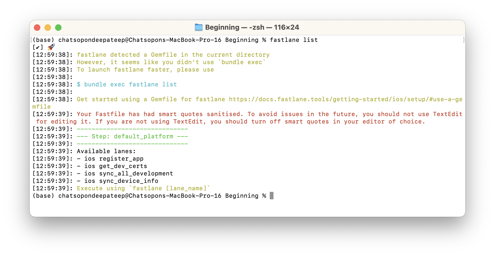
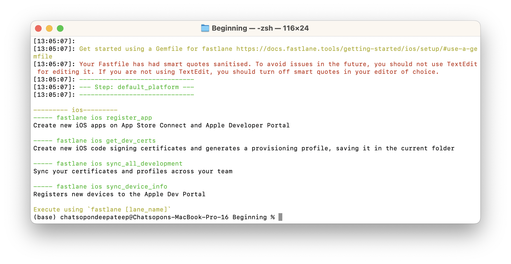

# Fastlane for iOS

### Contents
- Prepare for Fastlane
- Init Fastlane
- Produce
- Platfroms & Lanes
- Match (Team-based code signing)
- Lane Tips
- Beta Testing Workflow

### Resources
- http://fastlane.tools
- http://spaceship.airforce

### Basic Fastlane commands

- `fastlane actions <action>` or 
  - information for a specific action
  - for example, `fastlane actions produce`
- `fastlane <action> --help`
  - list of action's in-lane Ruby parameters
- `fastlane produce`
  - Create new iOS apps on App Store Connect
- `fastlane cert`
  - Create new iOS code signing certificates
  - `fastlane cert revoke_expired`
    - Revoke the expired certifications
- `fastlane sigh`
  - Generates a provisioning profile, saving it in the current folder
- `fastlane match`
  - Sync the certificates and profiles across the team
- `fastlane match nuke <mode>` 
  - command is used to completely delete (nuke) certificate management data and provisioning profile management data in an Apple Developer account or a Google Play user account. This command is useful when you want to start fresh with certificate and provisioning profile management or when you need to delete problematic data.
  - Please note that the `nuke` command should be used with caution, as deleting data in developer or user accounts is irreversible. Make sure you have backed up any important data before using this command.
  - Example
    - fastlane match nuke distribution 
- `fastlane gym`
  - Automate beta deployments and releases for the iOS apps.

## Prepare for Fastlane

- Install `brew`
  - `/bin/bash -c "$(curl -fsSL https://raw.githubusercontent.com/Homebrew/install/HEAD/install.sh)"`
- Prepare `ruby` with `chruby` and `ruby-install`
  - [Learn more](https://stackoverflow.com/questions/51126403/you-dont-have-write-permissions-for-the-library-ruby-gems-2-3-0-directory-ma)
  - `brew install chruby ruby-install`
  - `ruby-install` Install the latest version of ruby, for example, 3.2.2
  - add this commands in `.zshrc`
    - `source /opt/homebrew/opt/chruby/share/chruby/chruby.sh` (for calling chruby)
    - `source /opt/homebrew/opt/chruby/share/chruby/auto.sh` (auto switching)
  - (optional) If you don't remember what version you've been installed, run `chruby`
  - switch to specific ruby version
    - `chruby 3.2.2`
- Install `fastlane`
  - `gem install bundler`
  - `gem install fastlane`
  
## Init Fastlane
In our project, for initializing the fastlane you need to call `fastlane init`



We will now see the `Gemfile`. This contains fastlane configuration settings, and you'll also see `fastlane` folder which contains `Appfile` and `Fastfile` .
We will create custom lanes in `Fastfile` through this note.



## Produce

Create new iOS apps on App Store Connect using your command line. [Learn more](https://docs.fastlane.tools/actions/produce/)

```
fastlane produce \
--username your_apple_id@email.com
--app_identifier com.company.app
--app_name "Your App Name"
--team_name "Your team's name"
--itc_team_name "The name of Apple connect team id"
```

## Platforms & Lanes

In `Fastflie`, you can create custome lanes here. (Ruby syntax)

```rb
platform :ios do
  
  lane :first do
    archive
    sign
    upload
    
  lane :second do
    build_app(scheme: "My App")
    upload_to_testflight
  
end
```

Then in Terminal you can call `fastlane first` to do the `first` lane.

## 2 Example Lanes

We can define `app_identifier`, `apple_id` and `team_id` in Appfile then if there are any required parameters including these three variables we can skip it.



## Match (Team-based code signing)

A new approach to iOS and macOS code signing: Share one code signing identity across your development team to simplify your codesigning setup and prevent code signing issues.

Step
- Run `fastlane match init`
- Choose the storage mode for example, `git`
- Provide the URL of Git Repo

Then, you can see, this has created a new Matchfile with your repo's URL



Then, you can run `fastlane match development`, `fastlane match adhoc` and `fastlane match appstore`. This ensure that we'll have these in place

You can now take a look at the results in the repo. With those commands, match has created a full set of team code signing assets that cover all phases of iOS development. Note that all our certificates, along their private keys, live inside a certs folder.

From here on out, whenever anyone on our team needs to set up a new development machine, all they're going to have to do is follow the README.



You can now fun `match` or create a lane included `match`

```ruby
lane :sync_all_development do
	match(type: "development")
end
```

### Register Devices

Registers new devices to the Apple Dev Portal

```ruby
lane :sync_device_info do
	register_devices(
		devices: {
			"Ei’s iPhone" => "00008120-0**************E"
		}
	)
end
```

## Lane Tips

### Lane Flow Control

Ruby has a very rich collection of flow control operators, this is the simple if-else block

```ruby
lane :my_lane do
	...
	if some_variable == true
		# do something stuff
	else
		# do somthing else
	end
	...
end
```

### Exiting a lane early

We can use `next` keyword to early exit before it reaches the end.

```ruby
lane :my_lane do
	...
	if some_variable == true
		next
	end
	...
end
```

### Lane variables

We can define and use variables.

```ruby
lane :my_lane do
	...
	my_var = "some value"
	some_action(
		parameter: my_var
	)
	...
end
```

### Returning lane values

We can return values by simply placing it in the last line of lane.

```ruby
lane :return_something do
	a_var = 4
	...
	a_var + 2
end
```

and we can use the returned values.

```ruby
lane :use_returned_value do
	...
	new_val = return_something * 10
	...
end
```

### Lane input

We can accept input in a lane.

```ruby
lane :hello_from do |options|
	...
	if options[:who] == "john"
		...
	end
end
```

```ruby
lane :try_hello do
	hello_from(who: "john")
end
```

### Prompting Users

```ruby
lane :prompts do
	UI.messsage "message (usually white)"
	UI.success "message (usually green)"
	UI.error "message (usually red)"
	UI.important "message (usually yellow)"

	# Input
	pw = UI.password("Your password: ") # password inputs are hidden

	# Confirmation
	email = UI.input("Your email: ")
	if UI.confirm("Confirm your email: #{email}")
		UI.success("Confirmed")
		...
	else
		# Stop the process
		next
	end
end
```

### CLI from lane

```
fastlane run some_action a_param: "Hi" b_param: true
```

### Shell from lane

You have the ability within lanes to directly invoke shell commands and retireve thier results

```ruby
lane :hi_shell do
	you = sh "whoami"
	UI.header "Hello, " + you
end
```

### List all lanes

It's natural to want to know at a glance what lanes are available for a given project. Simply call `fastlane list`



As well as an annotated one `fastlane lanes`



### Private Lanes

```ruby
private_lane :some_action do
	...
end
```

## Beta Testing Workflow

### Gym

The way to automate beta deployments and releases for your iOS and Android apps.

### Init Gym

The command, `fastlane gym init`, scaffolds a new Ruby Gymfile configuration in our project fastlane subdirectory. As with other fastlane config files, setting here in `Gymfile` effectively serve as project-wide defaults applying to gym in both the command line and in lanes.

```ruby
clean true
scheme "Our Scheme"
```

...
